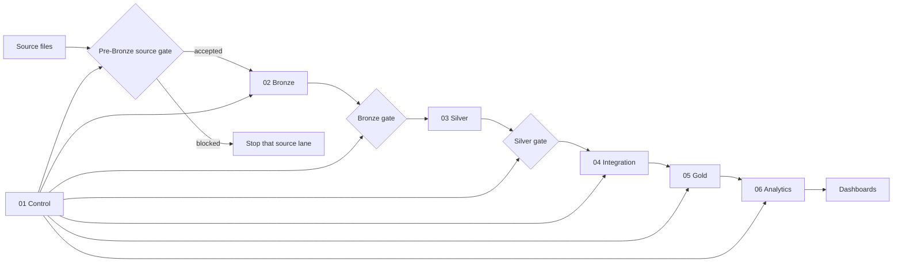

# NYC Mobility Pipeline

An end-to-end Databricks lakehouse pipeline built by **Group A, FTW Data
Engineering Batch 12**.

The project combines NYC Green Taxi trips, Open-Meteo historical weather, and
NYC Taxi Zone data to produce validated Gold tables, Analytics datasets, and
dashboards.

## Tools used

<p>
  
  
  
  
  
  
  
  
</p>

[Architecture](docs/architecture/overview.md) ·
[Data model](docs/architecture/data-model.md) ·
[Setup](docs/getting-started/terminal-setup.md) ·
[Operations](docs/operations/runbook.md) ·
[Evidence](evidence/README.md) ·
[Contributing](CONTRIBUTING.md)

## Overview

### What this project answers

- When and where does recorded Green Taxi activity happen?
- How does trip behavior vary across observed weather conditions?
- Which Taxi Zones show the most pickup and drop-off activity?

These are descriptive questions about the available records. The results do not
represent all NYC transportation demand or prove that weather causes changes in
taxi activity.

### Why we built it

The project demonstrates how a data pipeline can:

- combine data from multiple sources;
- validate data before it reaches trusted tables;
- process new data incrementally;
- recover safely from failures;
- publish analytics-ready datasets;
- track which code and source data produced a result;
- move changes from development to production through a controlled workflow.

## Pipeline at a glance



Each source moves through its own source, Bronze, and Silver gates. Integration
begins only after all required Silver gates pass.

When a blocking check fails, that task fails and dependent trusted layers do
not run. Think of each gate as a checkpoint: data must pass inspection before it
can move to the next area.

## Data sources

| Source | Purpose | Format |
|---|---|---|
| NYC TLC Green Taxi | Recorded trip and mobility activity | Parquet |
| Open-Meteo archive | Hourly citywide weather approximation | JSON |
| NYC Taxi Zones | Pickup and drop-off zone reference data | CSV |

The approved source registry is maintained in
[`config/sources.json`](config/sources.json). Required structures and minimum
acceptance rules are defined in
[`config/source_contract.json`](config/source_contract.json).

Traffic advisories were evaluated and deliberately deferred. They are not a
dependency of the implemented pipeline.

## How the data changes

| Layer | Responsibility |
|---|---|
| Control | Tracks pipeline runs, ingestion batches, source versions, and quality results |
| Source gate | Uses DuckDB to inspect files before ingestion |
| Bronze | Preserves accepted source records with ingestion metadata |
| Silver | Cleans, standardizes, deduplicates, and quarantines invalid records |
| Integration | Aligns sources before dimensional modeling |
| Gold | Publishes conformed facts and dimensions |
| Analytics | Produces datasets designed for reporting and dashboards |

For field-level lineage, see the
[source-to-target mapping](docs/architecture/source-to-target.md).

## Data products

### Gold layer

| Table | Grain |
|---|---|
| `fact_taxi_trip` | One accepted Green Taxi trip |
| `fact_weather_hourly` | One coordinate, UTC observation hour, and weather model |

Shared dimensions include:

- `dim_date`
- `dim_hour`
- `dim_taxi_zone`
- `dim_weather_classification`

Weather remains at hourly grain so its measurements are not multiplied by the
number of trips in the same hour.

### Analytics layer

The pipeline publishes:

- `activity_by_time_and_zone`
- `trip_behavior_by_weather`
- `trip_weather_coverage`
- `mobility_patterns_by_zone`

See the [data model](docs/architecture/data-model.md) and
[data dictionary](docs/architecture/data-dictionary.md) for the complete
contracts.

## Project status

### What is implemented

- Three source-specific DuckDB gates before Bronze ingestion
- Control, Bronze, Silver, Integration, Gold, and Analytics transformations
- A multi-task Databricks Asset Bundle
- Separate development and production targets
- Data-quality, analytics, and pipeline-execution dashboards
- Local and CI contract tests
- GitHub Actions validation and controlled deployment workflows
- Operational monitoring, recovery instructions, and governance documentation

### What is proven

Committed evidence records:

- a complete end-to-end run;
- March → April → May incremental loading;
- an identical-input rerun;
- controlled failure and recovery;
- a blocked pre-Bronze delivery;
- DuckDB-to-Bronze reconciliation;
- deployed runs tied to recorded code revisions.

See the [evidence index](evidence/README.md) for the relevant run IDs, revisions,
results, and limitations.

> Repository state and deployed workspace state are different. A commit on
> `main` should not be described as live until its deployed revision and
> resulting Databricks run have been verified.

## Getting started

### Prerequisites

For local repository validation:

- Git
- Python 3
- access to this repository

For Databricks bundle validation:

- Databricks CLI
- an approved workspace profile
- the required workspace permissions

See the complete [terminal setup guide](docs/getting-started/terminal-setup.md).

### Installation

Clone the repository:

```bash
git clone https://github.com/hyenalouise/nyc-mobility-pipeline.git
cd nyc-mobility-pipeline
```

Install the local validation dependencies:

```bash
python3 -m pip install -r requirements-dev.txt
```

### Run local checks

```bash
python3 -m pytest tests
git diff --check
```

The full Databricks pipeline does not run locally. These checks validate
repository contracts and DuckDB source-gate behavior.

They do not prove:

- Spark or Delta runtime behavior;
- Unity Catalog permissions;
- SQL warehouse availability;
- deployed job configuration;
- production execution.

## Usage

### Validate the Databricks bundle

Development target:

```bash
databricks bundle validate \
  --target dev \
  --profile crystal-workspace
```

Production target:

```bash
databricks bundle validate \
  --target prod \
  --profile crystal-workspace
```

Bundle validation is read-only. Deployment and job execution change external
state and must follow the approved workflow.

Before deploying or running the pipeline, review:

- [Job setup](docs/operations/job-setup.md)
- [Development workflow](docs/operations/workflow.md)
- [Deployment process](docs/operations/deployment.md)
- [Monitoring guide](docs/operations/monitoring.md)
- [Failure runbook](docs/operations/runbook.md)

## Repository structure

```text
nyc-mobility-pipeline/
├── .github/               Pull-request templates, CI, and deployment workflows
├── config/                Source registry and source contracts
├── dashboards/            Databricks dashboard definitions
├── docs/                  Architecture, data, operations, and governance
├── etl/                   SQL transformations organized by pipeline stage
├── evidence/
│   ├── pipeline-runs/     Human-readable run evidence
│   └── source-validation/ Machine-readable source-gate results
├── notebooks/             Profiling and investigation notebooks
├── src/ingestion/         DuckDB source-gate implementation and helpers
├── tests/                 Repository and pipeline contract tests
├── databricks.yml         Databricks job, target, and dashboard configuration
└── requirements-dev.txt   Local validation dependencies
```

The numbered `etl/` folders describe the intended processing order. The task
dependencies defined in `databricks.yml` remain the executable authority.

## Documentation guide

| I want to… | Read |
|---|---|
| Understand the complete pipeline | [Architecture overview](docs/architecture/overview.md) |
| Understand tables and relationships | [Data model](docs/architecture/data-model.md) |
| Inspect columns and measures | [Data dictionary](docs/architecture/data-dictionary.md) |
| Understand ingestion and reruns | [Ingestion guide](docs/data/ingestion.md) |
| Understand validation gates | [Validation contract](docs/data/validation.md) |
| Inspect the Databricks task graph | [Job setup](docs/operations/job-setup.md) |
| Make and deliver a change | [Workflow](docs/operations/workflow.md) |
| Respond to a failure | [Runbook](docs/operations/runbook.md) |
| Understand ownership | [Ownership and governance](docs/governance/ownership.md) |
| See why a decision was made | [Decision log](docs/governance/decisions.md) |
| Understand DuckDB's role | [DuckDB documentation](docs/tools/duckdb/README.md) |
| Review recorded results | [Evidence index](evidence/README.md) |

The complete canonical documentation map is in
[`docs/README.md`](docs/README.md).

## Known limitations

- Weather represents one documented NYC coordinate rather than a separate
  observation for every Taxi Zone.
- The UTC weather series and NYC-local trip timestamps create a documented
  boundary-coverage gap; see the [decision log](docs/governance/decisions.md)
  and [validation contract](docs/data/validation.md).
- Traffic-advisory analysis remains deferred.
- Local and CI tests cannot prove live workspace permissions or runtime
  behavior.
- A repository change is not production evidence until the deployed revision
  and resulting run are verified.
- The course workspace does not yet fully implement the intended
  least-privilege access model.
