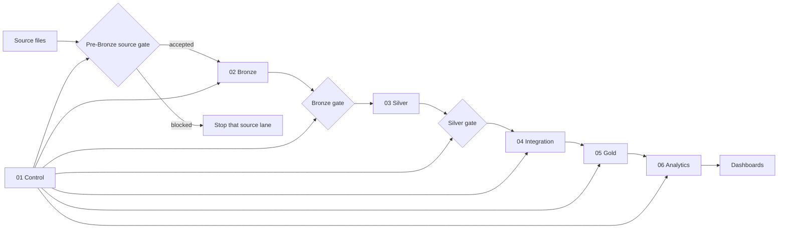

# NYC Mobility Pipeline

An end-to-end Databricks lakehouse pipeline built by Group A for the FTW Data
Engineering track. It combines NYC Green Taxi trips, Open-Meteo historical
weather, and the NYC Taxi Zone lookup into validated Gold and Analytics data
products.

## Current verified state

The repository currently contains:

- three source-specific DuckDB gates that run before Bronze;
- Control, Bronze, Silver, Integration, Gold, and Analytics transformations;
- a 34-task Databricks Asset Bundle job definition;
- separate development and production bundle targets;
- data-quality, analytics, and pipeline-execution dashboards;
- local and CI tests for repository policy, bundle structure, source gates,
  control flow, traceability, and monitoring;
- committed evidence for a full run, incremental loading, idempotency,
  failure/restart, source-gate blocking, and DuckDB reconciliation.

Repository state and deployed workspace state are different things. A commit can
be present on `main` before it is deployed. Verify the deployed Git revision and
job state in Databricks before describing a repository change as live.

See [Evidence](evidence/proof/README.md) for recorded run IDs and results, and
[Documentation](docs/README.md) for the canonical document map.

## Pipeline at a glance



The three sources advance independently through their own source, Bronze, and
Silver gates. Integration begins only after all required Silver gates pass.
Blocking checks fail their task, so dependent trusted layers are skipped.

## Data sources

| Source | Role | Source format |
|---|---|---|
| NYC TLC Green Taxi | Trip-level recorded mobility activity | Parquet |
| Open-Meteo archive | Hourly citywide weather approximation | JSON |
| NYC Taxi Zones | Pickup and drop-off reference members | CSV |

The approved registry is [config/sources.json](config/sources.json). Required
source structure and minimum acceptance rules are in
[config/source_contract.json](config/source_contract.json).

Traffic advisories were evaluated and deliberately deferred. They are not a
dependency of the implemented pipeline.

## Data products

The Gold model contains two fact tables at different grains:

| Table | Grain |
|---|---|
| `fact_taxi_trip` | One accepted Green Taxi trip |
| `fact_weather_hourly` | One coordinate, UTC observation hour, and weather model |

Shared dimensions are `dim_date`, `dim_hour`, `dim_taxi_zone`, and
`dim_weather_classification`. Keeping weather at hourly grain prevents its
measurements from being multiplied by the number of trips in that hour.

The Analytics layer publishes:

- `activity_by_time_and_zone`;
- `trip_behavior_by_weather` and `trip_weather_coverage`;
- `mobility_patterns_by_zone`.

See [Data model](docs/architecture/data-model.md) and
[Data dictionary](docs/architecture/data-dictionary.md) for the complete contract.

## Repository map

| Location | Responsibility |
|---|---|
| `.github/` | Pull-request templates, CI, and controlled deployment |
| `config/` | Non-secret project, naming, source, and source-contract configuration |
| `dashboards/` | Bundle-owned Databricks dashboard definitions |
| `docs/` | Architecture, contracts, workflow, governance, and tool documentation |
| `etl/` | Ordered SQL implementation by pipeline stage |
| `evidence/proof/` | Immutable, reviewed proof summaries and compact results |
| `notebooks/` | Profiling and investigation, not the production implementation |
| `src/ingestion/` | Executable Python source gates plus retained ingestion helpers |
| `tests/` | Local and CI contract tests |
| `databricks.yml` | Executable job, dashboard, target, schedule, and notification definition |

The numbered `etl/` folders describe execution order. The Databricks task graph
in `databricks.yml` remains the executable authority for actual dependencies.

## Quick start

### Local validation

```bash
python3 -m pip install -r requirements-dev.txt
python3 -m pytest tests
git diff --check
```

Local tests do not connect to Databricks. They validate repository contracts and
the DuckDB source-gate logic, not Spark, Delta, Unity Catalog permissions, or a
live warehouse.

### Bundle validation

Use the configured Databricks CLI profile and validate before any deployment:

```bash
databricks bundle validate --target dev --profile crystal-workspace
databricks bundle validate --target prod --profile crystal-workspace
```

Deployment and job execution change external state. Follow
[Workflow](docs/operations/workflow.md) and verify the selected target, profile,
commit, and resolved bundle settings before continuing.

## Documentation

Start with [docs/README.md](docs/README.md). It identifies the canonical owner
for each topic so the same operational fact is not maintained in several files.

| Need | Document |
|---|---|
| Understand the stages | [Architecture](docs/architecture/overview.md) |
| Understand grains and relationships | [Data model](docs/architecture/data-model.md) |
| Inspect fields and measures | [Data dictionary](docs/architecture/data-dictionary.md) |
| Understand ingestion and reruns | [Ingestion](docs/data/ingestion.md) |
| Understand gates and evidence | [Validation](docs/data/validation.md) |
| Inspect the task graph | [Job setup](docs/operations/job-setup.md) |
| Make and deliver a change | [Workflow](docs/operations/workflow.md) |
| Deploy through GitHub Actions | [Deployment](docs/operations/deployment.md) |
| Monitor runs and data | [Monitoring](docs/operations/monitoring.md) |
| Operate or recover the pipeline | [Runbook](docs/operations/runbook.md) |
| Understand ownership and access | [Governance](docs/governance/ownership.md) |
| Understand why a choice was made | [Decision log](docs/governance/decisions.md) |
| Understand DuckDB's role | [DuckDB](docs/tools/duckdb/README.md) |

## Evidence

Committed evidence is intentionally small. Raw data, full exports, large logs,
and workspace screenshots do not belong in Git.

The evidence index records:

- the full end-to-end proof run;
- March → April → May incremental behavior;
- an identical-input rerun;
- a controlled failure and restart;
- DuckDB-to-Bronze reconciliation;
- a deployed run with a recorded code revision;
- a pre-Bronze source-gate block and its operational limitations.

See [evidence/proof/README.md](evidence/proof/README.md).

## Known limitations

- Weather represents one documented NYC coordinate, not one observation per
  Taxi Zone.
- Weather matching covers 133,173 of 133,353 accepted trips; 180 accepted trips
  have no matching weather hour because of the UTC/local reporting boundary.
- Traffic-advisory analysis is deferred.
- `supersedes_batch_id` exists but is not currently populated.
- `batch_tracking.py` and `schema_drift_check.py` are retained helpers but are
  not invoked by the configured job.
- Local and CI tests cannot prove live workspace permissions or runtime behavior.
- Course-environment production access is broader than a least-privilege target.
- A repository change is not production evidence until the deployed revision
  and resulting run are verified.

## Contribution and security

Follow [CONTRIBUTING.md](CONTRIBUTING.md). Never commit credentials, Databricks
profiles, raw source datasets, local processing databases, notebook outputs,
or large generated evidence.
