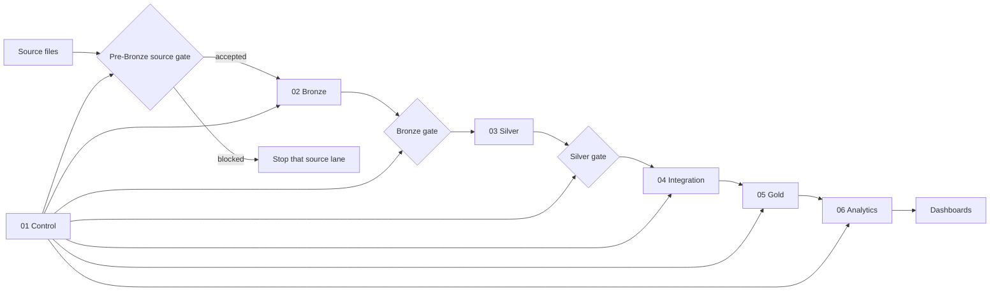

# NYC Mobility Pipeline

An end-to-end Databricks lakehouse pipeline built by Group A for the FTW Data
Engineering track. It combines NYC Green Taxi trips, Open-Meteo historical
weather, and the NYC Taxi Zone lookup into validated Gold and Analytics data
products.

## What this project answers

- When and where does recorded Green Taxi activity happen?
- How does trip behavior vary across observed weather conditions?
- Which Taxi Zones show the most pickup and drop-off activity?

The project treats these as descriptive questions about the available records,
not as measurements of total demand or proof that weather causes trip behavior.

## Tools used

<p>
  
  
  
  
  
  
  
  
</p>

## Pipeline at a glance



The three sources advance independently through their own source, Bronze, and
Silver gates. Integration begins only after all required Silver gates pass.
Blocking checks fail their task, so dependent trusted layers are skipped.

## What is implemented

- Three source-specific DuckDB gates that run before Bronze.
- Control, Bronze, Silver, Integration, Gold, and Analytics transformations.
- A multi-task Databricks Asset Bundle with separate development and production
  targets.
- Data-quality, analytics, and pipeline-execution dashboards.
- Local and CI tests for repository policy, bundle structure, source gates,
  control flow, traceability, documentation, and monitoring.
- A controlled GitHub Actions deployment workflow.

## What is proven

Committed evidence records:

- a complete end-to-end run;
- March → April → May incremental behavior;
- an identical-input rerun;
- controlled failure and recovery;
- a blocked pre-Bronze delivery;
- DuckDB-to-Bronze reconciliation;
- deployed runs tied to recorded code revisions.

Repository state and deployed workspace state are different things. A commit can
be present on `main` before it is deployed. Verify the deployed Git revision and
job state in Databricks before describing a repository change as live. See the
[evidence index](evidence/README.md) for the recorded run IDs and results.

## Data sources

| Source | Role | Source format |
|---|---|---|
| NYC TLC Green Taxi | Trip-level recorded mobility activity | Parquet |
| Open-Meteo archive | Hourly citywide weather approximation | JSON |
| NYC Taxi Zones | Pickup and drop-off reference members | CSV |

The approved registry is [config/sources.json](config/sources.json). Required
source structure and minimum acceptance rules are in
[config/source_contract.json](config/source_contract.json).

Traffic advisories were evaluated and deliberately deferred. They are not a
dependency of the implemented pipeline.

## Data products

The Gold model contains two fact tables at different grains:

| Table | Grain |
|---|---|
| `fact_taxi_trip` | One accepted Green Taxi trip |
| `fact_weather_hourly` | One coordinate, UTC observation hour, and weather model |

Shared dimensions are `dim_date`, `dim_hour`, `dim_taxi_zone`, and
`dim_weather_classification`. Keeping weather at hourly grain prevents its
measurements from being multiplied by the number of trips in that hour.

The Analytics layer publishes:

- `activity_by_time_and_zone`;
- `trip_behavior_by_weather` and `trip_weather_coverage`;
- `mobility_patterns_by_zone`.

See the [data model](docs/architecture/data-model.md) and
[data dictionary](docs/architecture/data-dictionary.md) for the complete
contract.

## Start here

| I want to… | Start with |
|---|---|
| Understand the pipeline | [Architecture](docs/architecture/overview.md) |
| Set up Git and the Databricks CLI | [Terminal setup](docs/getting-started/terminal-setup.md) |
| Understand the source data | [Source profile](docs/data/source-profile.md) |
| Inspect the configured job | [Job setup](docs/operations/job-setup.md) |
| Make and deliver a change | [Workflow](docs/operations/workflow.md) |
| Deploy through GitHub Actions | [Deployment](docs/operations/deployment.md) |
| Monitor execution and data quality | [Monitoring](docs/operations/monitoring.md) |
| Respond to a failed run | [Runbook](docs/operations/runbook.md) |
| Contribute to the repository | [Contributing guide](CONTRIBUTING.md) |

The complete canonical document map is in
[docs/README.md](docs/README.md).

### Local validation

```bash
python3 -m pip install -r requirements-dev.txt
python3 -m pytest tests
git diff --check
```

The full pipeline does not run locally. Local tests validate repository
contracts and DuckDB source-gate logic; they do not prove Spark, Delta, Unity
Catalog permissions, a live SQL warehouse, or deployed job behavior.

### Databricks bundle validation

Use the configured Databricks CLI profile and validate before any deployment:

```bash
databricks bundle validate --target dev --profile crystal-workspace
databricks bundle validate --target prod --profile crystal-workspace
```

Bundle validation is read-only. Deployment and job execution change external
state; follow the [workflow](docs/operations/workflow.md) and verify the target,
profile, commit, and resolved bundle settings before continuing.

## Known limitations

- Weather represents one documented NYC coordinate, not one observation per
  Taxi Zone.
- The UTC weather series and NYC-local trip timestamps create a documented
  boundary-coverage gap; see the [decision log](docs/governance/decisions.md)
  and [validation contract](docs/data/validation.md).
- Traffic-advisory analysis remains deferred.
- Local and CI tests cannot prove live workspace permissions or runtime
  behavior.
- A repository change is not production evidence until the deployed revision
  and resulting run are verified.

## Contribution and security

Follow [CONTRIBUTING.md](CONTRIBUTING.md). Never commit credentials, Databricks
profiles, raw source datasets, local processing databases, notebook outputs,
or large generated evidence.
