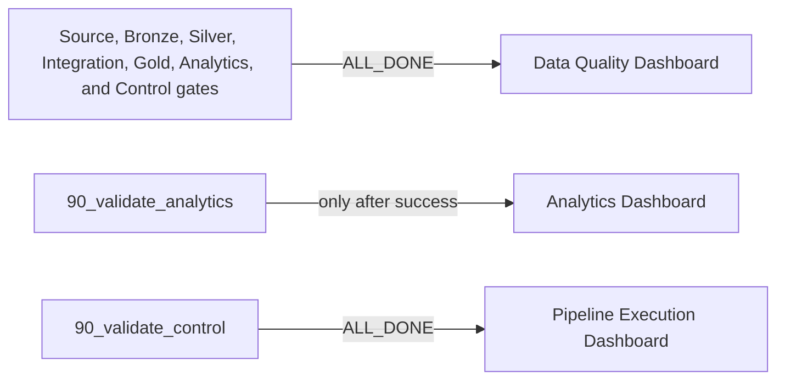

# Dashboards

This folder contains Databricks Lakeview dashboard definitions owned by the
Asset Bundle. `databricks.yml` declares each resource and connects its refresh
task to the appropriate validation task.

| Folder | Dashboard | Reads | Job dependency |
|---|---|---|---|
| `11_data_quality_dashboard/` | NYC Mobility Data Quality Dashboard | `01-control.data_quality_results` and gate state | Validation tasks; refresh is allowed after failed upstream work so failures remain visible |
| `11_analytics_dashboard/` | NYC Mobility Analytics Dashboard | Validated Gold and Analytics outputs | `90_validate_analytics` |
| `11_pipeline_execution_monitoring/` | NYC Mobility Pipeline Execution Dashboard | Pipeline run and operational state | `90_validate_control`; refresh uses operational completion behavior |

## Refresh dependencies

`ALL_DONE` lets the operational dashboards refresh after either success or
failure. The Analytics dashboard refreshes only after validated Analytics output
is available.

## Source of truth

The `.lvdash.json` files are the deployable definitions. Bundle resource names
and job dependencies are defined in `databricks.yml`. The task inventory is
documented in [`docs/operations/job-setup.md`](../docs/operations/job-setup.md).

Do not hardcode a workspace dashboard ID into the job definition. A new target
must be able to create or update the bundle-owned resource from this repository.

## Change procedure

1. Make or export the dashboard change from the approved workspace process.
2. Review the JSON diff for unexpected workspace-specific values.
3. Update `databricks.yml` if the resource or task dependency changed.
4. Run the local tests and validate the bundle target.
5. Deploy to development and verify rendering and data sources.
6. Compare displayed values with the validated Analytics, Gold, or Control
   tables before promotion.

## Evidence boundary

A dashboard task succeeding proves that its refresh task completed. It does not
prove that every displayed number is correct. Record a human reconciliation
against the underlying validated table when the dashboard is first released or
materially changed.

Screenshots may be stored beside a definition only when they are small,
reviewed, free of sensitive values, and useful as durable evidence. Prefer a
run-specific evidence summary under `evidence/pipeline-runs/` for factual claims.
