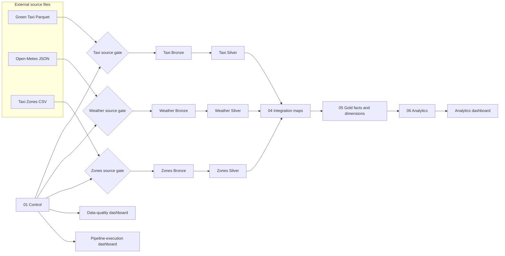

# Architecture

This document describes the implemented repository architecture. Deployment
state is external runtime state and must be verified separately in Databricks.

## System flow

Source, Bronze, and Silver gates preserve independent source lanes. Integration
is the convergence point. A failed gate prevents dependent trusted work from
running while unrelated source lanes may continue.

## Stages

| Stage | Responsibility | Persisted location |
|---|---|---|
| 00 Source | Immutable delivered files or saved responses | `00-source` Volume |
| 01 Control | Batches, pipeline runs, DQ results, shared status function and gate view | `01-control` |
| Pre-Bronze source gate | DuckDB contract checks before a loader can publish | Results recorded under layer `source` |
| 02 Bronze | Source-preserving values plus provenance | `02-bronze` |
| 03 Silver | Typed, standardized, accepted and quarantined records | `03-silver` |
| 04 Integration | Trip-to-zone and trip-to-weather relationship maps | `04-integration` |
| 05 Gold | Two facts and four shared dimensions | `05-gold` |
| 06 Analytics | Business-question datasets and coverage outputs | `06-analytics` |
| Dashboards | Quality, execution, and validated business views | Bundle-owned dashboard resources |

## Control plane

The Control layer is separate from business data because its lifecycle must
survive a rebuild of Bronze through Analytics.

It contains:

- `ingestion_batches` — source identity, status, timestamps, counts, and retry
  relationship;
- `pipeline_runs` — run identity, status, and code revision;
- `data_quality_results` — one result per check and run;
- `dq_status` — the shared INFO/WARN/FAIL status rule;
- `gate_status` — the most recent summarized outcome for each gate.

## Data plane

Bronze answers “what did we receive?”. Silver answers “what does a usable row
mean and what was its disposition?”. Integration answers “how do the sources
relate without changing trip grain?”. Gold publishes the approved dimensional
model. Analytics shapes validated answers for consumption.

## Storage and grain boundaries

- Bronze preserves source representation and lineage.
- Silver keeps one source-specific natural grain per dataset.
- `trip_zone_map` and `trip_weather_map` retain one row per accepted trip.
- `fact_taxi_trip` retains one row per accepted trip.
- `fact_weather_hourly` retains one row per coordinate, UTC hour, and model.
- Weather measurements never move onto every trip row.

See [data model](data-model.md) and
[source-to-target mapping](source-to-target.md).

## Execution architecture

`databricks.yml` defines the executable task graph, environments, parameters,
schedule, notifications, Python environment, SQL warehouse use, and dashboard
resources. SQL tasks run on the configured warehouse. The three Python source
gates run on serverless job compute with a pinned DuckDB dependency.

The bundle has separate development and production targets. Development uses a
personal workspace path and paused schedule. Production uses a shared path and
configured weekly schedule. Repository configuration describes intended state;
verify Databricks for the deployed revision and live state.

## Failure boundaries

- A blocked source gate stops its Bronze loader.
- A failed Bronze or Silver gate stops the next step in that source lane.
- Integration requires all required Silver gates.
- Gold requires Integration.
- Analytics and its business dashboard require the Gold and Analytics gates.
- Operational dashboards may run with `ALL_DONE` dependencies so failures remain
  visible.

See [validation](../data/validation.md), [job setup](../operations/job-setup.md),
and [runbook](../operations/runbook.md).
