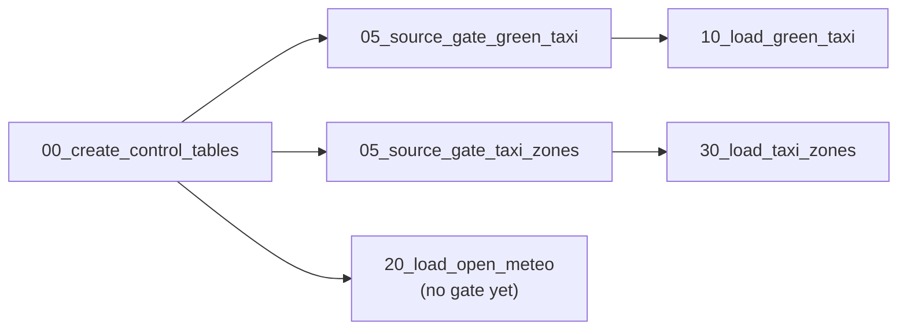

# Databricks job setup

How to wire the pipeline as one multi-task Databricks **Job**. A job is used rather than a declarative ETL pipeline because the loads use `COPY INTO` and `MERGE` into our own tables, the control tables are ours (`ingestion_batches`, DQ results), and each gate must fail its task so later stages are skipped.

## Job settings

These values come from `databricks.yml`. If the two disagree, `databricks.yml` is right.

| Setting | Value |
|---|---|
| Name | `NYC Mobility Pipeline`. A `dev` deploy creates a separate `[dev <your-name>] NYC Mobility Pipeline` |
| Source | Git provider, this repository, pinned to the commit that was deployed (`${bundle.git.commit}`), not a branch |
| Compute | 33 tasks. One SQL warehouse, `${var.warehouse_id}`, runs the 28 SQL file tasks and 3 dashboard tasks. The 2 source-gate tasks are Python, so they run on serverless job compute (environment `source_gate`, `duckdb==1.1.3`). No clusters |
| Parameters | `code_revision`, which defaults to the deployed commit so every quality result records the code that produced it (D25). `green_taxi_input`, `taxi_zones_input` and `weather_input`, which default to the landing paths the loaders read, and can point one gate at a test folder (#158) |
| Schedule | Weekly, Monday 06:00 `America/New_York`. Paused in `dev`, running in `prod`. Weekly because the source is monthly, so a daily run would find nothing new most days (D27) |
| Notifications | Email on failure. In `dev`, only the person who deployed it (`${workspace.current_user.userName}`); in `prod`, the whole team, since that's a shared pipeline (#131) |

Using the Git provider rather than a personal Git folder means every run uses reviewed code and records the commit it ran.

## Tasks

Dependencies are what enforce the gates: if a validation task fails, everything after it is skipped. Tasks with no dependency between them run in parallel, so the three sources move independently until Integration.

Task keys and dependencies are the ones in `databricks.yml`, which is what the Databricks UI shows. `tests/test_job_setup_doc.py` fails if this table and the job drift apart.

| Task key | Type | File | Depends on |
|---|---|---|---|
| `00_create_control_tables` | SQL file | `etl/01_control/00_create_control_tables.sql` | — |
| `90_validate_control` | SQL file | `etl/01_control/90_validate_control.sql` | `10_load_green_taxi`, `20_load_open_meteo`, `30_load_taxi_zones` |
| `05_source_gate_green_taxi` | Python file, serverless | `src/ingestion/source_gate.py --source green_taxi` | `00_create_control_tables` |
| `05_source_gate_taxi_zones` | Python file, serverless | `src/ingestion/source_gate.py --source taxi_zones` | `00_create_control_tables` |
| `05_source_gate_weather` | Python file, serverless | `src/ingestion/source_gate.py --source weather` | `00_create_control_tables` |
| `10_load_green_taxi` | SQL file | `etl/02_bronze/10_load_green_taxi.sql` | `05_source_gate_green_taxi` |
| `20_load_open_meteo` | SQL file | `etl/02_bronze/20_load_open_meteo.sql` | `05_source_gate_weather` |
| `30_load_taxi_zones` | SQL file | `etl/02_bronze/30_load_taxi_zones.sql` | `05_source_gate_taxi_zones` |
| `90_validate_green_taxi` | SQL file | `etl/02_bronze/90_validate_green_taxi.sql` | `10_load_green_taxi` |
| `90_validate_open_meteo` | SQL file | `etl/02_bronze/90_validate_open_meteo_weather.sql` | `20_load_open_meteo` |
| `90_validate_taxi_zones` | SQL file | `etl/02_bronze/90_validate_taxi_zones.sql` | `30_load_taxi_zones` |
| `10_clean_green_taxi` | SQL file | `etl/03_silver/10_clean_green_taxi.sql` | `90_validate_green_taxi` |
| `20_clean_weather_hourly` | SQL file | `etl/03_silver/20_clean_weather_hourly.sql` | `90_validate_open_meteo` |
| `30_clean_taxi_zones` | SQL file | `etl/03_silver/30_clean_taxi_zones.sql` | `90_validate_taxi_zones` |
| `90_validate_clean_green_taxi` | SQL file | `etl/03_silver/90_validate_green_taxi.sql` | `10_clean_green_taxi` |
| `90_validate_clean_taxi_zones` | SQL file | `etl/03_silver/90_validate_taxi_zones.sql` | `30_clean_taxi_zones` |
| `90_validate_clean_weather_hourly` | SQL file | `etl/03_silver/90_validate_weather_hourly.sql` | `20_clean_weather_hourly` |
| `10_resolve_trip_zones` | SQL file | `etl/04_integration/10_resolve_trip_zones.sql` | `90_validate_clean_green_taxi`, `90_validate_clean_taxi_zones`, `90_validate_clean_weather_hourly`, `90_validate_control` |
| `20_resolve_trip_weather` | SQL file | `etl/04_integration/20_resolve_trip_weather.sql` | `10_resolve_trip_zones` |
| `90_validate_integration` | SQL file | `etl/04_integration/90_validate_integration.sql` | `20_resolve_trip_weather` |
| `10_dim_date` | SQL file | `etl/05_gold/10_dim_date.sql` | `90_validate_integration` |
| `11_dim_hour` | SQL file | `etl/05_gold/11_dim_hour.sql` | `90_validate_integration` |
| `12_dim_taxi_zone` | SQL file | `etl/05_gold/12_dim_taxi_zone.sql` | `90_validate_integration` |
| `13_dim_weather_classification` | SQL file | `etl/05_gold/13_dim_weather_classification.sql` | `90_validate_integration` |
| `20_fact_weather_hourly` | SQL file | `etl/05_gold/20_fact_weather_hourly.sql` | `10_dim_date`, `11_dim_hour`, `12_dim_taxi_zone`, `13_dim_weather_classification` |
| `30_fact_taxi_trip` | SQL file | `etl/05_gold/30_fact_taxi_trip.sql` | `20_fact_weather_hourly` |
| `90_validate_gold` | SQL file | `etl/05_gold/90_validate_gold.sql` | `20_fact_weather_hourly`, `30_fact_taxi_trip` |
| `10_activity_by_time_and_zone` | SQL file | `etl/06_analytics/10_activity_by_time_and_zone.sql` | `90_validate_gold` |
| `20_trip_behavior_by_weather` | SQL file | `etl/06_analytics/20_trip_behavior_by_weather.sql` | `90_validate_gold` |
| `30_mobility_patterns_by_zone` | SQL file | `etl/06_analytics/30_mobility_patterns_by_zone.sql` | `90_validate_gold` |
| `90_validate_analytics` | SQL file | `etl/06_analytics/90_validate_analytics.sql` | `10_activity_by_time_and_zone`, `20_trip_behavior_by_weather`, `30_mobility_patterns_by_zone` |

## Dashboards

Dashboards are job tasks like everything above, added after the tasks that
produce the data they read. Both are bundle-owned resources
(`resources.dashboards` in `databricks.yml`) rather than hardcoded dashboard
ids: each entry points at a `.lvdash.json` file under `dashboards/`, and the
job's `dashboard_task` entries reference the resource by id. A deploy into a
workspace that has never held these dashboards creates them there, instead
of failing on an id that only exists in the workspace they were originally
built in (#122).

| Task key | Dashboard | Source file | Depends on |
|---|---|---|---|
| `dq_dashboard` | NYC Mobility Data Quality Dashboard | `dashboards/11_data_quality_dashboard/10_NYC_mobility_data_quality_dashboard.lvdash.json` | every validation gate task |
| `nyc_mobility_analytics` | NYC Mobility Analytics Dashboard | `dashboards/11_analytics_dashboard/10_NYC_mobility_analytics_dashboard.lvdash.json` | `90_validate_analytics` |
| `pipeline_execution_monitoring` | NYC Mobility Pipeline Execution Dashboard | `dashboards/11_pipeline_execution_monitoring/10_NYC_mobility_pipeline_execution_dashboard.lvdash.json` | `90_validate_control` |

`dq_dashboard` and `pipeline_execution_monitoring` both run regardless of
whether upstream tasks passed or failed (`run_if: ALL_DONE`), so a failing
pipeline still gets a refreshed view of what failed — data quality in one
case, run health in the other. `nyc_mobility_analytics` only runs after the
analytics gate passes, since it presents validated business answers and has
nothing meaningful to show otherwise.

## Source gates before Bronze (#148)

Green Taxi and Taxi Zones are checked before they are loaded. Each source-gate task runs the DuckDB gate on that source's files in the Volume, records one row per check in `data_quality_results` under layer `source`, and exits 1 if the delivery is BLOCKED. The task then fails, so that source's loader and everything after it are skipped while the other sources carry on (D17). Open-Meteo has no gate until it has a contract (#125).

Each loader waits only for its own source's gate, so a BLOCKED Green Taxi delivery stops Green Taxi and nothing else. Task names are the task keys in `databricks.yml`:



### Testing a gate without touching the landing folder (#158)

Each gate reads its input from a job parameter: `green_taxi_input`, `taxi_zones_input` or `weather_input`. The default is the landing path its loader reads, so a normal or scheduled run checks exactly what gets loaded. To show a gate refusing a bad delivery, stage the bad file in a separate folder and point only that gate at it:

```bash
databricks bundle run NYC_Mobility_Pipeline --target dev --profile crystal-workspace --params 'green_taxi_input=/Volumes/ftw-week-08/00-source/group_a_source/_test/green_taxi_blocked/*.parquet'
```

Keep the quotes. Without them zsh, the default shell on a Mac, tries to expand the `*` itself and stops with `no matches found` before the job starts.

To repeat a test, start a new run with the override. A repair started from the CLI without parameters goes back to the defaults, so its gate checks the landing folder instead of the test folder (#158).

The loaders always read the landing folder, so test data is never loaded. An override run also never loads anything else: each gate is given the path its loader reads (`--load-input`), and when its input differs, the gate records its results and then fails its task even if the test input passed (exit 4). The loader and everything after it are skipped, so no run loads landing files it didn't check (#159). `tests/test_bundle_contract.py` fails if a gate's `--load-input` or its parameter's default stops matching its loader's path exactly.

The gate is Python, and the SQL warehouse only runs SQL, so these three tasks run on serverless job compute. Their environment pins `duckdb==1.1.3`, the same version as `requirements-dev.txt`, CI and the committed evidence. `tests/test_bundle_contract.py` fails if the two pins drift, or if a loader stops waiting for its gate.

## What makes a gate real

A validation query that prints `BLOCKED` does not fail a task. Every `90_validate_*` file must end with something that errors. This is the end of `etl/02_bronze/90_validate_green_taxi.sql`; `dq_run_id` is declared at the top of the same file, so the block doesn't run on its own:

```sql
SELECT CASE
         WHEN COUNT_IF(status = 'FAIL') > 0
         THEN raise_error(concat('Bronze green_taxi gate BLOCKED: ',
                                 CAST(COUNT_IF(status = 'FAIL') AS STRING), ' failed checks'))
       END
FROM `ftw-week-08`.`01-control`.data_quality_results
WHERE run_id = dq_run_id;
```

Placeholder files already end with a `raise_error`, so an unimplemented stage fails instead of looking successful. Remove that block when the query is written.

## Failure notifications

`email_notifications.on_failure` sends an email the moment any task fails, so a failure reaches a person instead of waiting for someone to open Databricks. This exists because of the Day 9 incident: a Silver gate blocked correctly, but with no notification, a stale dashboard reached management before the team knew anything had failed.

Who gets it depends on the target. In `dev`, only the person who deployed that job (`${workspace.current_user.userName}`), since each dev job is someone's own sandbox. In `prod`, the whole team, listed in the prod target in `databricks.yml`, so one person being unavailable doesn't mean nobody finds out. A cancelled run sends nothing (`no_alert_for_canceled_runs`).

No duration-based warning is configured, since no duration threshold is currently set for this job. A blocked gate and a genuine task crash trigger the same email for now; telling them apart would need logic beyond Databricks' native job notifications, which is out of scope here (see #131).

## Proof runs

| Proof | How to run it | Evidence |
|---|---|---|
| Incremental (#45) | March in the Volume, run the job; add April, run; add May, run | Three run histories, row counts per file |
| Idempotency (#46) | Run again with May already loaded | Same row counts and content; the skip appears in `ingestion_batches` |
| Failure recovery (#47) | Cancel a task mid-run, then use **Repair run** | Only the failed task and its dependents re-run; no duplicates |

Commit short summaries under `evidence/proof/`, not full exports.

## Later

The task graph now lives in `databricks.yml`, which is the definition the job actually runs from. This document explains the shape and the reasoning; `databricks.yml` is the source of truth for the tasks themselves.
