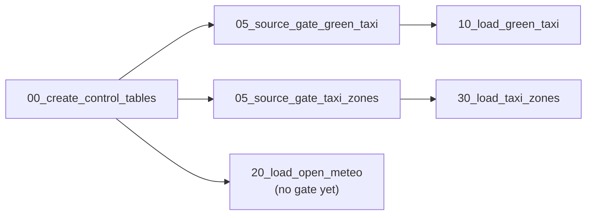

# Databricks job setup

How to wire the pipeline as one multi-task Databricks **Job**. A job is used rather than a declarative ETL pipeline because the loads use `COPY INTO` and `MERGE` into our own tables, the control tables are ours (`ingestion_batches`, DQ results), and each gate must fail its task so later stages are skipped.

## Job settings

These values come from `databricks.yml`. If the two disagree, `databricks.yml` is right.

| Setting | Value |
|---|---|

| Setting | Value |
|---|---|
| Name | `NYC Mobility Pipeline`. A `dev` deploy creates a separate `[dev <your-name>] NYC Mobility Pipeline` |
| Source | Git provider, this repository, pinned to the commit that was deployed (`${bundle.git.commit}`), not a branch |
| Compute | 32 tasks. One SQL warehouse, `${var.warehouse_id}`, runs the 28 SQL file tasks and 2 dashboard tasks. The 2 source-gate tasks are Python, so they run on serverless job compute (environment `source_gate`, `duckdb==1.1.3`). No clusters |
| Parameters | `code_revision`, which defaults to the deployed commit so every quality result records the code that produced it (D25) |
| Schedule | Weekly, Monday 06:00 `America/New_York`. Paused in `dev`, running in `prod`. Weekly because the source is monthly, so a daily run would find nothing new most days (D27) |
| Notifications | Email on failure. In `dev`, only the person who deployed it (`${workspace.current_user.userName}`); in `prod`, the whole team, since that's a shared pipeline (#131) |

Using the Git provider rather than a personal Git folder means every run uses reviewed code and records the commit it ran.

## Tasks

Dependencies are what enforce the gates: if a validation task fails, everything after it is skipped. Tasks with no dependency between them run in parallel, so the three sources move independently until Integration.

| Task key | Type | File | Depends on |
|---|---|---|---|
| `control_setup` | SQL file | `etl/01_control/00_create_control_tables.sql` | — |
| `gate_source_green_taxi` | Python file, serverless | `src/ingestion/source_gate.py --source green_taxi` | `control_setup` |
| `gate_source_taxi_zones` | Python file, serverless | `src/ingestion/source_gate.py --source taxi_zones` | `control_setup` |
| `gate_control` | SQL file | `etl/01_control/90_validate_control.sql` | the three load tasks |
| `load_green_taxi` | SQL file | `etl/02_bronze/10_load_green_taxi.sql` | `gate_source_green_taxi` |
| `load_open_meteo` | SQL file | `etl/02_bronze/20_load_open_meteo.sql` | `control_setup` |
| `load_taxi_zones` | SQL file | `etl/02_bronze/30_load_taxi_zones.sql` | `gate_source_taxi_zones` |
| `gate_bronze_green_taxi` | SQL file | `etl/02_bronze/90_validate_green_taxi.sql` | `load_green_taxi` |
| `gate_bronze_open_meteo` | SQL file | `etl/02_bronze/90_validate_open_meteo_weather.sql` | `load_open_meteo` |
| `gate_bronze_taxi_zones` | SQL file | `etl/02_bronze/90_validate_taxi_zones.sql` | `load_taxi_zones` |
| `clean_green_taxi` | SQL file | `etl/03_silver/10_clean_green_taxi.sql` | `gate_bronze_green_taxi` |
| `clean_weather_hourly` | SQL file | `etl/03_silver/20_clean_weather_hourly.sql` | `gate_bronze_open_meteo` |
| `clean_taxi_zones` | SQL file | `etl/03_silver/30_clean_taxi_zones.sql` | `gate_bronze_taxi_zones` |
| `gate_silver_green_taxi` | SQL file | `etl/03_silver/90_validate_green_taxi.sql` | `clean_green_taxi` |
| `gate_silver_weather_hourly` | SQL file | `etl/03_silver/90_validate_weather_hourly.sql` | `clean_weather_hourly` |
| `gate_silver_taxi_zones` | SQL file | `etl/03_silver/90_validate_taxi_zones.sql` | `clean_taxi_zones` |
| `resolve_trip_zones` | SQL file | `etl/04_integration/10_resolve_trip_zones.sql` | all three `gate_silver_*` |
| `resolve_trip_weather` | SQL file | `etl/04_integration/20_resolve_trip_weather.sql` | `resolve_trip_zones` |
| `gate_integration` | SQL file | `etl/04_integration/90_validate_integration.sql` | `resolve_trip_weather` |
| `dim_date` | SQL file | `etl/05_gold/10_dim_date.sql` | `gate_integration` |
| `dim_hour` | SQL file | `etl/05_gold/11_dim_hour.sql` | `gate_integration` |
| `dim_taxi_zone` | SQL file | `etl/05_gold/12_dim_taxi_zone.sql` | `gate_integration` |
| `dim_weather_classification` | SQL file | `etl/05_gold/13_dim_weather_classification.sql` | `gate_integration` |
| `fact_weather_hourly` | SQL file | `etl/05_gold/20_fact_weather_hourly.sql` | the four dimension tasks |
| `fact_taxi_trip` | SQL file | `etl/05_gold/30_fact_taxi_trip.sql` | `fact_weather_hourly` |
| `gate_gold` | SQL file | `etl/05_gold/90_validate_gold.sql` | both fact tasks |
| `analytics_activity` | SQL file | `etl/06_analytics/10_activity_by_time_and_zone.sql` | `gate_gold` |
| `analytics_weather` | SQL file | `etl/06_analytics/20_trip_behavior_by_weather.sql` | `gate_gold` |
| `analytics_zones` | SQL file | `etl/06_analytics/30_mobility_patterns_by_zone.sql` | `gate_gold` |
| `gate_analytics` | SQL file | `etl/06_analytics/90_validate_analytics.sql` | the three analytics tasks |

## Dashboards

Dashboards are job tasks like everything above, added after the tasks that
produce the data they read. Both are bundle-owned resources
(`resources.dashboards` in `databricks.yml`) rather than hardcoded dashboard
ids: each entry points at a `.lvdash.json` file under `dashboards/`, and the
job's `dashboard_task` entries reference the resource by id. A deploy into a
workspace that has never held these dashboards creates them there, instead
of failing on an id that only exists in the workspace they were originally
built in (#122).

| Task key | Dashboard | Source file | Depends on |
|---|---|---|---|
| `dq_dashboard` | NYC Mobility Data Quality Dashboard | `dashboards/11_data_quality_dashboard/10_NYC_mobility_data_quality_dashboard.lvdash.json` | every validation gate task |
| `nyc_mobility_analytics` | NYC Mobility Analytics Dashboard | `dashboards/11_analytics_dashboard/10_NYC_mobility_analytics_dashboard.lvdash.json` | `gate_analytics` |

`dq_dashboard` runs regardless of whether upstream tasks passed or failed
(`run_if: ALL_DONE`), so a failing pipeline still gets a refreshed data
quality view showing what failed. `nyc_mobility_analytics` only runs after
the analytics gate passes, since it presents validated business answers and
has nothing meaningful to show otherwise.

## Source gates before Bronze (#148)

Green Taxi and Taxi Zones are checked before they are loaded. Each source-gate task runs the DuckDB gate on that source's files in the Volume, records one row per check in `data_quality_results` under layer `source`, and exits 1 if the delivery is BLOCKED. The task then fails, so that source's loader and everything after it are skipped while the other sources carry on (D17). Open-Meteo has no gate until it has a contract (#125).

Each loader waits only for its own source's gate, so a BLOCKED Green Taxi delivery stops Green Taxi and nothing else. Task names are the task keys in `databricks.yml`:



The gate is Python, and the SQL warehouse only runs SQL, so these two tasks run on serverless job compute. Their environment pins `duckdb==1.1.3`, the same version as `requirements-dev.txt`, CI and the committed evidence. `tests/test_bundle_contract.py` fails if the two pins drift, or if a loader stops waiting for its gate.

## What makes a gate real

A validation query that prints `BLOCKED` does not fail a task. Every `90_validate_*` file must end with something that errors:

```sql
SELECT CASE
         WHEN COUNT_IF(status = 'FAIL') > 0
         THEN raise_error(concat('Bronze green_taxi gate BLOCKED: ',
                                 CAST(COUNT_IF(status = 'FAIL') AS STRING), ' failed checks'))
       END
FROM `ftw-week-08`.`01-control`.green_taxi_data_quality_results
WHERE run_id = dq_run_id;
```

Placeholder files already end with a `raise_error`, so an unimplemented stage fails instead of looking successful. Remove that block when the query is written.

## Failure notifications

`email_notifications.on_failure` in `databricks.yml` sends an email to the
whole team the moment any task fails — not just whoever happens to open
Databricks and notice. This exists because of the Day 9 incident: a Silver
gate blocked correctly, but with no notification, a stale dashboard reached
management before the team knew anything had failed.

Sent to every team member rather than one shared inbox, since one person
being unavailable should not mean nobody finds out:

- briana.capul@ftwfoundation.org
- hazelle.cuevas@ftwfoundation.org
- crystal.manas@ftwfoundation.org
- gabrielle.torres@ftwfoundation.org
- ina.magno@ftwfoundation.org

No duration-based warning is configured, since no duration threshold is
currently set for this job. A blocked gate and a genuine task crash both
trigger the same notification for now; distinguishing them would need logic
beyond Databricks' native job-level notifications, which is out of scope
here (see #131).

## Proof runs

| Proof | How to run it | Evidence |
|---|---|---|
| Incremental (#45) | March in the Volume, run the job; add April, run; add May, run | Three run histories, row counts per file |
| Idempotency (#46) | Run again with May already loaded | Same row counts and content; the skip appears in `ingestion_batches` |
| Failure recovery (#47) | Cancel a task mid-run, then use **Repair run** | Only the failed task and its dependents re-run; no duplicates |

Commit short summaries under `evidence/proof/`, not full exports.

## Later

The task graph now lives in `databricks.yml`, which is the definition the job actually runs from. This document explains the shape and the reasoning; `databricks.yml` is the source of truth for the tasks themselves.
