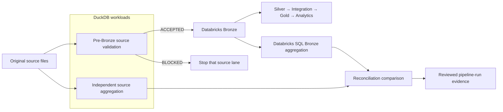

# DuckDB documentation

DuckDB has a narrow role in this project: validate source deliveries close to
their files and provide an independent reconciliation path without replacing
the Databricks lakehouse.

## Where DuckDB fits

DuckDB supports two documented workloads:

| Workload | Where it runs | Result |
|---|---|---|
| Pre-Bronze source validation | Locally, in CI with generated fixtures, and in the Databricks job on serverless compute | An acceptance verdict, compact JSON evidence, and job-time rows in `01-control.data_quality_results` |
| Independent reconciliation | Against the original source files, separately from the Databricks SQL aggregation of Bronze | A reviewed comparison of source and Bronze counts or measures |

The pre-Bronze gate is part of the configured production job. The independent
reconciliation is recorded proof, not a recurring task in `databricks.yml`.
DuckDB never reads the Bronze Delta table during that reconciliation; keeping
the source-side calculation separate is what makes the comparison independent.

| Document | Purpose |
|---|---|
| [source-gate.md](source-gate.md) | Inputs, outputs, exit codes, and runtime behavior of the pre-Bronze gate |
| [validation-checks.md](validation-checks.md) | Source-specific checks, severities, thresholds, and ownership |
| [evidence.md](evidence.md) | How local and committed DuckDB evidence is generated and interpreted |

The executable implementation is `src/ingestion/source_gate.py`; the approved
contract is `config/source_contract.json`; the configured production tasks are
in `databricks.yml`.

The same source-gate module and pinned DuckDB dependency are used locally, in
CI, and by the three Databricks source-gate tasks. The gate reads supplied files
without downloading them or requiring source-system network access.

DuckDB does not replace Spark SQL transformations, Delta tables, Unity Catalog
governance, Databricks scheduling, dashboards, or workspace-specific
integration testing. See the committed
[source-validation results](../../../evidence/source-validation/) and
[pipeline-run evidence](../../../evidence/pipeline-runs/) for recorded outcomes.
