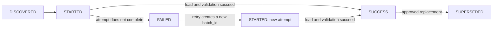

# 01 — Control

Control stores operational state that must survive business-table rebuilds.

## Batch lifecycle

A failed attempt remains in history. Retrying creates a new batch record instead
of rewriting the failed one, while a superseded success remains available for
lineage.

| File | Purpose |
|---|---|
| `00_create_control_tables.sql` | Creates `ingestion_batches`, `pipeline_runs`, `data_quality_results`, the shared `dq_status` function, and the latest `gate_status` view |
| `90_validate_control.sql` | Checks batch presence, uniqueness, duplicate successful content, lifecycle consistency, stuck batches, and retry history |

Control answers questions such as “has this source content already succeeded?”,
“which code revision produced this result?”, and “which gate most recently
passed or failed?”. Processing state advances only after the corresponding load
and required validation succeed.

The shared result contract is documented in
[`docs/data/validation.md`](../../docs/data/validation.md).
