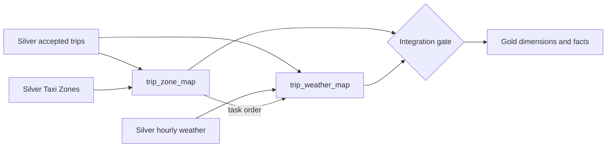

# 04 — Integration

Integration resolves accepted trips to pickup and drop-off zones and to the
pickup weather hour. It preserves one mapping row per accepted trip and records
unmatched or special-member outcomes explicitly.

## Integration flow

The two maps retain one row per accepted trip. Zone and weather match outcomes
remain explicit so unmatched records can be measured instead of disappearing
inside a join.

| File | Persisted output | Purpose |
|---|---|---|
| `10_resolve_trip_zones.sql` | `04-integration.trip_zone_map` | Resolves pickup and drop-off zone roles with independent match statuses |
| `20_resolve_trip_weather.sql` | `04-integration.trip_weather_map` | Resolves each trip to zero or one pickup-hour weather classification |
| `90_validate_integration.sql` | DQ results | Checks key coverage, ambiguity, fan-out, unmatched counts, and reconciliation |

Integration runs only after the Green Taxi, Weather, and Taxi Zones Silver gates
pass. Gold consumes the validated maps; it does not infer relationships again.

See [`docs/data/validation.md`](../../docs/data/validation.md) for recorded join coverage.
