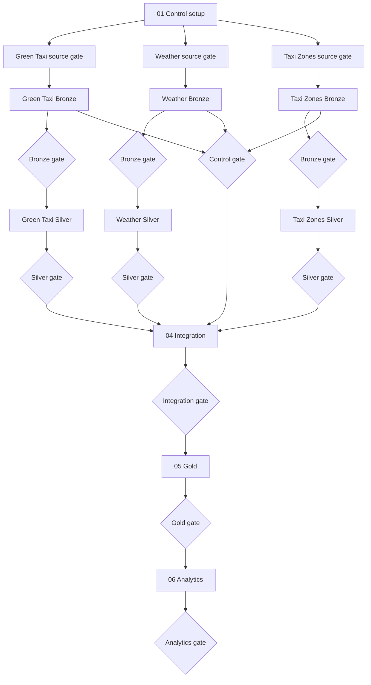

# ETL implementation

Production SQL is organized in pipeline order:

1. `01_control/` — operational state and the shared DQ contract
2. `02_bronze/` — source-preserving ingestion and Bronze gates
3. `03_silver/` — typing, standardization, disposition, and Silver gates
4. `04_integration/` — trip-to-zone and trip-to-weather relationship maps
5. `05_gold/` — approved dimensions, facts, and the Gold gate
6. `06_analytics/` — business-question datasets and the Analytics gate

## Execution shape

The source lanes can advance independently through Silver. They converge only
after every required Silver gate succeeds.

The folder number indicates logical execution order. Actual runtime dependencies
are defined in [`databricks.yml`](../databricks.yml) and documented in
[`docs/operations/job-setup.md`](../docs/operations/job-setup.md).

## File conventions

- `00_` initializes shared objects.
- `10_`, `20_`, and `30_` load or transform data.
- `90_validate_...` is the gate for a source or combined layer.
- Files use lowercase names and explicit numeric ordering.
- Persisted tables use fully qualified catalog, schema, and table names.

Validation stays beside the data it validates. Bronze and Silver have one gate
per source because each source defines good data differently. Integration, Gold,
and Analytics use combined gates after the source lanes converge.

The source gates that run before Bronze are Python and live in
[`src/ingestion/source_gate.py`](../src/ingestion/source_gate.py).

## Change rule

When adding or removing an ETL file, update:

1. the relevant layer README;
2. `databricks.yml` when it is a job task;
3. `docs/operations/job-setup.md` when the task graph changes;
4. tests that enforce bundle and documentation parity.
