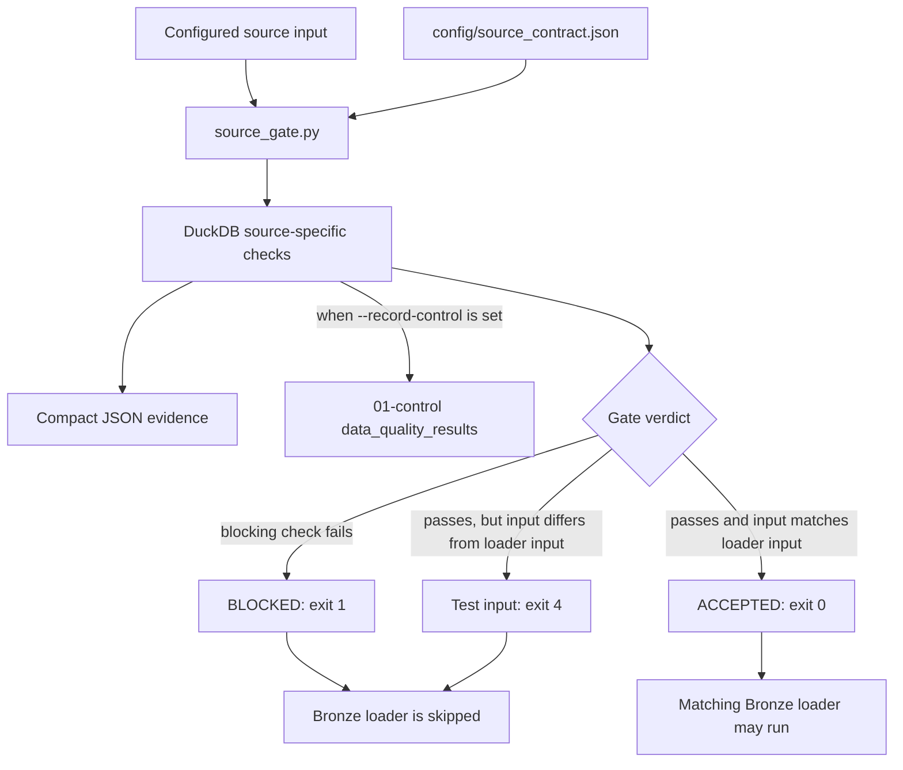

# Ingestion and source-gate Python

## Source-gate decision flow

Invalid configuration and unavailable input use their documented nonzero exit
codes before a delivery can advance. See the linked source-gate reference for
the complete exit-code contract.

## Active module

| Module | Status | Purpose |
|---|---|---|
| `source_gate.py` | Active | Runs source-specific DuckDB checks before Bronze, emits compact evidence, records DQ rows when configured, and exits nonzero when publication must stop |

The gate supports `green_taxi`, `taxi_zones`, and `weather`. Its contracts come
from `config/source_contract.json`. The Databricks job invokes the same module
for all three source lanes.

## Retained helpers

| Module | Status | Purpose |
|---|---|---|
| `batch_tracking.py` | Not wired into the configured job | Reusable file identity and batch-state helper from an earlier ingestion approach |
| `schema_drift_check.py` | Not wired into the configured job | Reusable source-schema comparison helper |

Retained helpers should not be described as production behavior. A future change
must either wire them into one approved execution path, move them to an examples
or tools area, or remove them through review.

## Boundaries

- Source acceptance logic belongs in `source_gate.py` and the source contract.
- Bronze persistence belongs in `etl/02_bronze/`.
- Batch and DQ table definitions belong in `etl/01_control/`.
- Production task dependencies belong in `databricks.yml`.
- Investigation belongs in `notebooks/`.

See [`docs/tools/duckdb/source-gate.md`](../../docs/tools/duckdb/source-gate.md) and
[`docs/data/ingestion.md`](../../docs/data/ingestion.md).
